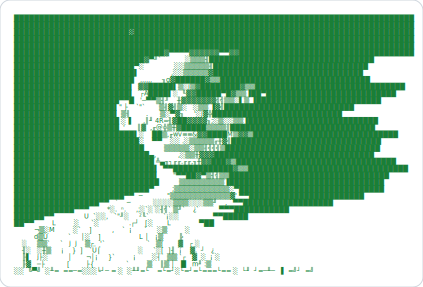

<div align="center">

<a href="https://github.com/harshmishra-1702">
  
</a>


</div>

---

```bash
$ whoami
> Harsh Mishra — Integrated M.Tech (Software Engineering), VIT University | CGPA: 9.61

$ cat role.txt
> AI Core Contributor & Data Trainer @ DataAnnotation (Part-time, Remote)
> Bilingual RLHF (English/Hindi) | Code Verification | Adversarial Testing

$ cat currently_learning.txt
> IBM RAG & Agentic AI Professional Certificate — Coursera (in progress)

$ ls skills/
> languages/     C++  Python  Java  TypeScript  JavaScript  SQL
> ai_ml/         LangChain  LlamaIndex  RAG  Agentic AI  ReAct  RLHF  Prompt Engineering
> vector_dbs/    FAISS  ChromaDB  Milvus
> llm_tools/     Groq  OpenAI API  HuggingFace  IBM watsonx.ai  Llama 3/4  Mixtral
> frameworks/    Flask  FastAPI  Streamlit  Gradio  React  PyTorch

$ ls projects/
> yt_rag_bot/            YouTube Q&A & Summarization Engine
                          Streamlit | LangChain LCEL | FAISS | Groq | AssemblyAI | yt-dlp
                          → github.com/harshmishra-1702/YT_RAG_BOT

> logiq_railway_triage/  AI-driven Railway Passenger Support System
                          Flask | Groq API | NLP | JavaScript
                          → github.com/harshmishra-1702/LOGIQ_Railway_Triage

> documind_ai/           Corporate Knowledge RAG Engine
                          FastAPI | React (Vite) | Gemini 2.5 Flash | PyPDF
                          → github.com/harshmishra-1702/DocuMind

> nutrition_ai/          AI-Powered Meal Nutrition Coach (Multimodal Vision)
                          Flask | Groq SDK | Llama 4 Scout | Python
                          → github.com/harshmishra-1702/Nutrition_AI

$ echo $STATUS
> Building AI systems that actually ship. Open to opportunities in GenAI engineering.
```

---

<div align="center">


[](https://linkedin.com/in/harshmishra1702)
[](https://github.com/harshmishra-1702)
[](mailto:mishraharsh6306@gmail.com)

</div>
